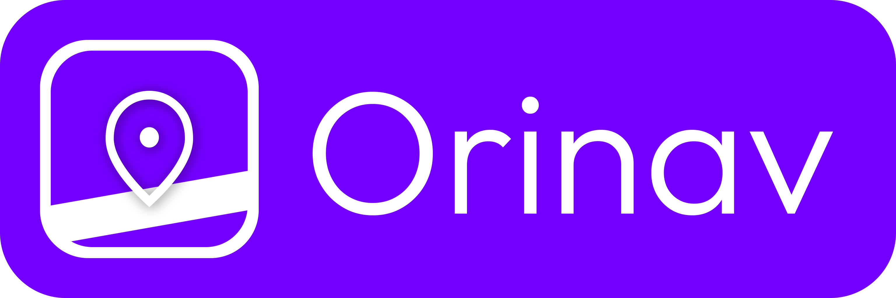

Welcome to Orinav!

Orinav is a new navigation app for people with visual impairments, produced through the research project "Multitasking Mobile Outdoors Navigation for People with Visual Impairments." Orinav seeks to integrate macro-navigation (route planning) and micro-navigation (environment awareness) in one cohesive experience to reduce friction when navigating.

* Navigate: Orinav provides step-by-step route guidance tailored with accessibility enhancements, including more frequent announcements, real-time direction guidance, and instant instruction replay by shaking your phone.
* Explore: Orinav implements machine learning-powered computer vision to detect obstacles, traffic lights, and tactile paving, supporting real-time decision-making for safe movement.

Orinav is currently under a source-available model.

## 📝 Installation

Users can install Orinav on the App Store. For development, please refer to "Development Setup" and build.

## 📚 Development Setup

**Prerequisites.** Xcode and CocoaPods.

1. Clone the repository.
2. Run `pod install`.
3. Open `BeaconNext.xcworkspace` in Xcode. Do not open `BeaconNext.xcodeproj`.
4. Create `BeaconNext/Configs/Secrets.xcconfig`. Put `TENCENT_API_KEY={key}` and `MAPBOX_ACCESS_TOKEN={token}` there.
5. Copy proprietary models to `BeaconNext/Library/Explore Features/Models`.
6. Build and run. (Development is typically done on a test device)

## 🤝 Feedback and Contributions

Please feel free to contribute by submitting an issue. Each contribution helps us grow and improve. We appreciate your support and look forward to making Orinav even better with your help!

## 📃 License

This product is distributed under a proprietary license. Please refer to [Orinav Terms of Service](https://orinav.com/terms) for details.

## 🗨️ Contacts

For more details about our services, feel free to reach out to us through the contact form on our website: [Orinav](https://orinav.com).

